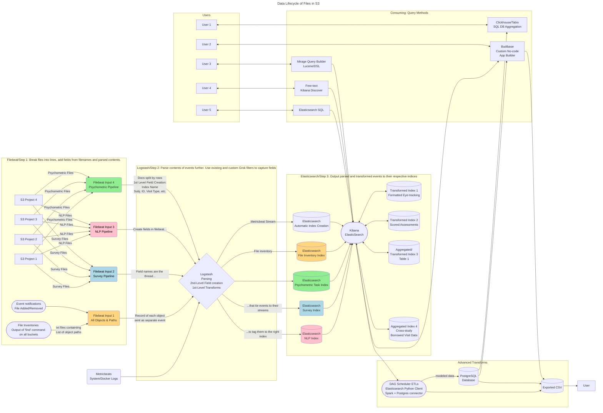

# Using the Elastic Stack for Research Data
Above is a simple example of how you can configure data pipelines from multiple S3 and local file sources using common parsing patterns and funnel them into organized indexes for fast free-text searches across categories and projects.

Files are first scanned from S3 buckets by Filebeat based on input settings defining a bucket, path to start from, and regex patterns to match filenames to include or exclude. 

They are usually read and sent to Logstash line by line, or json object by object, or csv row by row, or if multiline processors are defined, multiple lines or objects can be grouped into a single event.

Fields can be created both before and after being sent to Logstash, allowing specific ruled to be applied based on input, and blanket parsing rules to be applied on all events.

Field creation is a good way to control streaming trajectories for various events. Create a field at the input to group events in logstash into respective indices when they are output to Elasticsearch.


# Configuring the Elastic stack

When first spinning up elasticsearch, you'll want to run some setup scripts, which are included as part of a setup container in the docker-compose config. Simply uncomment it, run `docker-compose up -d`, then `docker compose down` uncomment it, and run `docker compose up -d` again.


## Filebeat

Filebeat scans the data sources and forwards info to logstash, which can then filter the incoming stream before sending it to elasticsearch

Configure its settings in filebeat.yml. Use the file in this link as a reference https://raw.githubusercontent.com/devopsschool-demo-labs-projects/elasticsearch/master/filebeat-config-file/filebeat.reference.yml 

Use this documentation to configure filebeat
https://www.elastic.co/guide/en/cloud/current/ec-getting-started-search-use-cases-beats-logstash.html#ec-beats-logstash-filebeat


To make a new field after data has been ingested, start with this block

```
def message = doc['aws.s3.object.key.keyword'].size() > 0 ? doc['aws.s3.object.key.keyword'].value : null;
if (message != null) {
    def match = /.*(\d{5}).*\..*/.matcher(message);
    if (match.find()) {
        emit(match.group(1));
        return;
    }
}
```

And replace match = {} with a regular expression capturing the field. The above extracts any number of 5 digits. To match the task label in a bids format, you could use

```
def message = doc['aws.s3.object.key.keyword'].size() > 0 ? doc['aws.s3.object.key.keyword'].value : null;
if (message != null) {
    def match = /.*task-(.*)_.*\..*/.matcher(message);
    if (match.find()) {
        emit(match.group(1));
        return;
    }
}
```

this will match any string that contains _task-(captured)_ and capture the part in parentheses for the field value.

In Kibana data views, select "Add a field" at the bottom of the page and place the above into the section "Set value"

# Using the Python Elasticsearch Client

```
from elasticsearch import Elasticsearch

# Password for the 'elastic' user generated by Elasticsearch
ELASTIC_PASSWORD = "<password>"

# Create the client instance
client = Elasticsearch(
    "https://localhost:9200",
    ca_certs="/path/to/http_ca.crt",
    basic_auth=("elastic", ELASTIC_PASSWORD)
)

# Successful response!
client.info()
# {'name': 'instance-0000000000', 'cluster_name': ...}
```

# Configuring Ingest Inputs in Filebeat

Filebeat handles the scanning of data on local and S3 storage. You can set rules on what it tries to read. In `filebeat/inputs/*.yml`, exclude filetypes that cannot be interpretted or expressed in text, such as MRI, audio, and video files. 

You can also set patterns on which file extensions you want to scan, and a prefix path to set an input to only scan a specific directory.

## Index files but drop or truncate their contents

If you want to include records of objects but don't care about their contents, you can drop fields that match a regex pattern with the `drop_fields` or `truncate_fields` processors in `filebeat.yml`

Files with multiple lines that aren't structured may end up creating hundreds or thousands of events for a single object, even if the fields are dropped, such as media files. To simply log the existence of files, the best way is to index a special bucket containing outputs to `find` command, and make an index just for that.

This way, you can search all of your buckets and directories with free-text without having to wait for the command to complete. Instead, schedule a task periodically in off-peak hours like `mc find path/to/s3 > bucket-name.txt && mc cp bucket-name.txt path/to/buckets-manifest`

As a filebeats input, scan files matching `*manifest.txt` from the manifests bucket then you can rapidly search for files of special type by name in free-text without expending resources trying to read their content.


## Aggregate documents accross indices into new indices
In the `transforms` directory you can create rules and mappings to filter and funnel your data into more structured indices
